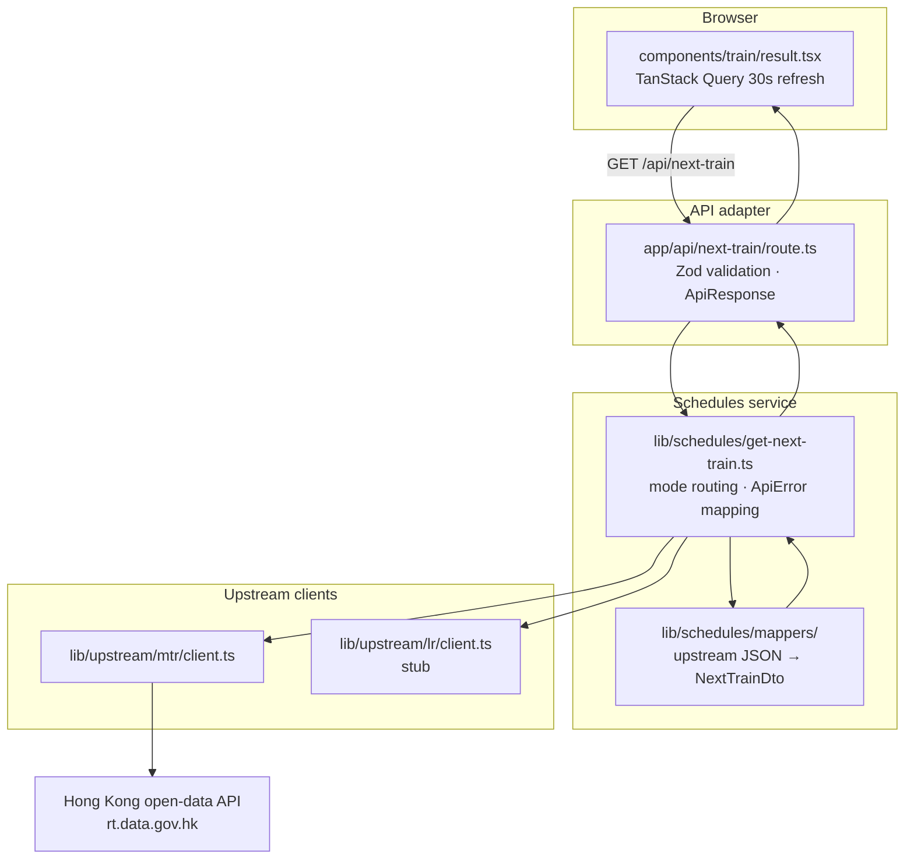
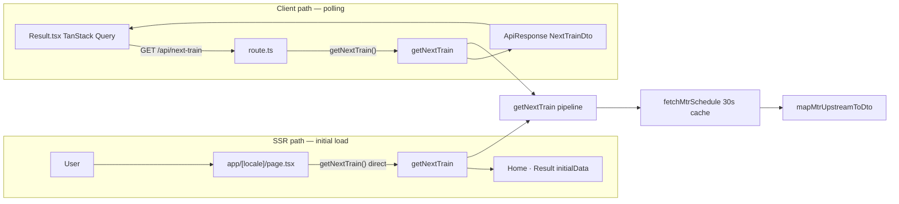
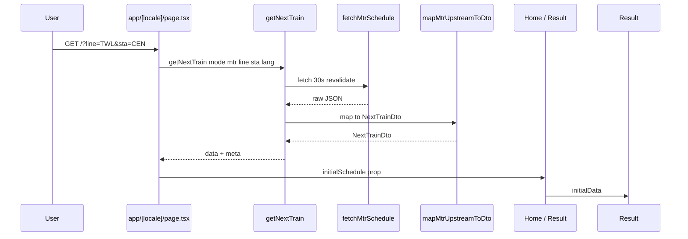
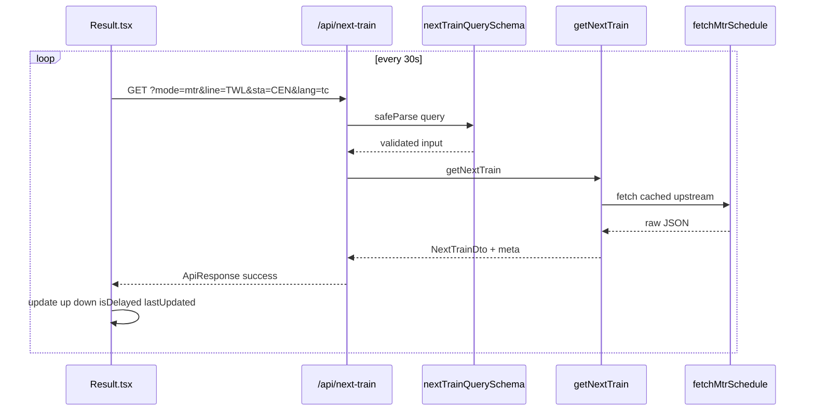

# NextMTRTrain

A [Next.js](https://nextjs.org/) app that shows **MTR next-train** information: line and station pickers, live schedules via the project API route, English and Traditional Chinese UI, and light/dark theme.

Live deployment: [nextjs-mtr.vercel.app](https://nextjs-mtr.vercel.app)

## Requirements

- **Node.js** 20.9 or newer (see `engines` in `package.json`)

## Setup

```bash
yarn install
cp .env.local.example .env.local
# Edit .env.local if you use Sentry (see below).
yarn dev
```

Open [http://localhost:3000](http://localhost:3000).

## Scripts

| Command            | Description                              |
| ------------------ | ---------------------------------------- |
| `yarn dev`         | Development server                       |
| `yarn build`       | Production build                         |
| `yarn start`       | Run production server                    |
| `yarn lint`        | ESLint                                   |
| `yarn verify`      | Mapper + MTR time self-checks            |
| `yarn check:mapper`| Runnable check for MTR schedule mapper   |

## Stack

- **Framework:** Next.js (App Router), React, TypeScript
- **UI:** Tailwind CSS v4, dark mode via `html.dark` class
- **State:** Redux Toolkit + react-redux (line/station selection)
- **Data:** TanStack Query for client polling; BFF route at `/api/next-train`
- **i18n:** next-intl
- **Validation:** Zod at the API route boundary
- **Monitoring (optional):** Sentry (`@sentry/nextjs`)
- **UX:** nextjs-toploader for route progress; date-fns for times

Formatting in the editor is typically handled with **Prettier** and **ESLint** (flat config: `eslint.config.mjs`, extends Next core-web-vitals + Prettier).

## Architecture

The app uses a **Backend-for-Frontend (BFF)** pattern. The browser never calls the Hong Kong government open-data API directly. All upstream access goes through a server-side schedules service, with a thin API route as the HTTP adapter.



### Folder layout

```
app/
├── [locale]/page.tsx          # SSR: calls getNextTrain() directly
└── api/next-train/route.ts    # Client polling endpoint

lib/
├── schedules/                 # Server-side schedules domain
│   ├── get-next-train.ts      # Orchestration entry point
│   ├── contracts/             # DTOs, ApiResponse, Zod schemas
│   ├── errors/api-error.ts    # ApiError + helpers
│   ├── http/respond.ts        # NextResponse adapters
│   └── mappers/               # Upstream JSON → NextTrainDto
└── upstream/                  # Raw fetch clients (server-only)
    ├── mtr/
    └── lr/                    # stub (not yet implemented)

components/                    # React UI (client)
store/                         # Redux: line/station selection only
utils/next-train-data.ts       # Static line/station metadata
```

### Layer responsibilities

| Layer | Location | Responsibility |
| ----- | -------- | -------------- |
| **UI** | `components/`, `app/[locale]/` | Render schedules; poll API via TanStack Query |
| **API adapter** | `app/api/next-train/` | Parse/validate HTTP input; return `ApiResponse<T>` |
| **Schedules service** | `lib/schedules/` | Orchestrate fetch → map → DTO; map errors |
| **Upstream** | `lib/upstream/` | Raw `fetch` to external APIs (30s revalidation) |
| **Static data** | `utils/next-train-data.ts` | Line/station codes and labels (no API call) |

Client components import types from `@lib/schedules/contracts/*` only — never from `lib/upstream/*`.

## Data flow

### Overview



### Initial page load (SSR)

When the user opens a URL with `?line=TWL&sta=CEN`, the server component fetches schedule data directly — no extra HTTP hop to the API route.



### Client refresh (TanStack Query)

After hydration, TanStack Query polls the BFF route every 30 seconds (aligned with upstream cache TTL). Manual refresh passes `fresh=1` to bypass server/CDN caches.



### API contract

**Request**

```
GET /api/next-train?mode=mtr&line=TWL&sta=CEN&lang=tc
```

| Param | Required | Default | Values |
| ----- | -------- | ------- | ------ |
| `mode` | No | `mtr` | `mtr`, `lr` (lr not yet implemented) |
| `line` | Yes | — | Line code, e.g. `TWL` |
| `sta` | Yes | — | Station code, e.g. `CEN` |
| `lang` | No | `tc` | `tc`, `en` |
| `fresh` | No | — | `1` or `true` bypasses server/CDN cache (manual refresh) |

MTR schedule mapping follows the [Next Train API spec v1.7](https://data.gov.hk/) (`lib/schedules/mappers/mtr-schedule.mapper.ts`).

**Success response**

```json
{
  "success": true,
  "data": {
    "up": [{ "seq": "1", "dest": "Tsuen Wan", "plat": "1", "time": "1 min" }],
    "down": [{ "seq": "1", "dest": "Central", "plat": "2", "time": "2 min" }],
    "isDelayed": false,
    "lastUpdated": "2026-07-11 01:00:05",
    "alert": null
  },
  "meta": {
    "source": "mtr",
    "revalidatedAt": "2026-07-11T01:00:05.000Z"
  }
}
```

**Error response**

```json
{
  "success": false,
  "error": { "code": "VALIDATION_ERROR", "message": "Invalid parameters" },
  "data": null
}
```

### Caching

| Layer | Mechanism | TTL |
| ----- | --------- | --- |
| Upstream fetch | `fetch(..., { next: { revalidate: 30 } })` | 30s |
| API response | `Cache-Control: public, s-maxage=30, stale-while-revalidate=60` | 30s |
| Client | TanStack Query `refetchInterval: 30000`, live ETA tick 1s | 30s / 1s |

SSR and API both call `getNextTrain()`, so Next.js fetch cache deduplicates upstream requests within the 30s window.

## Environment variables

Copy `.env.local.example` to `.env.local`. Tunables (cache TTLs, poll interval, cooldown) have defaults when unset. Invalid values fail at startup via Zod in `lib/env.ts`.

| Variable | Default | Notes |
| -------- | ------- | ----- |
| `MTR_NEXT_TRAIN_API_URL` | gov HK schedule URL | Upstream MTR API |
| `LR_NEXT_TRAIN_API_URL` | empty | Reserved for Light Rail |
| `SCHEDULE_REVALIDATE_SECONDS` | `30` | Next.js fetch revalidate |
| `SCHEDULE_S_MAXAGE_SECONDS` | `30` | API Cache-Control |
| `SCHEDULE_STALE_WHILE_REVALIDATE_SECONDS` | `60` | API Cache-Control |
| `ALERT_URL_ALLOWED_HOSTS` | `mtr.com.hk` | Comma-separated host suffixes |
| `FRESH_COOLDOWN_MS` | `10000` | Per-IP cooldown for `fresh=1` |
| `NEXT_PUBLIC_SITE_URL` | `http://localhost:3000` | metadataBase / OG |
| `NEXT_PUBLIC_SCHEDULE_POLL_MS` | `30000` | Client poll; set at build for client |
| `NEXT_PUBLIC_GITHUB_URL` | unset | Navbar GitHub button hidden if empty |
| `UPSTASH_*` / `RATE_LIMIT_*` / `SW_*` | see example | Rate limit + service worker (when wired) |

Sentry (`SENTRY_*`, `NEXT_PUBLIC_SENTRY_*`) is optional and can stay empty.
